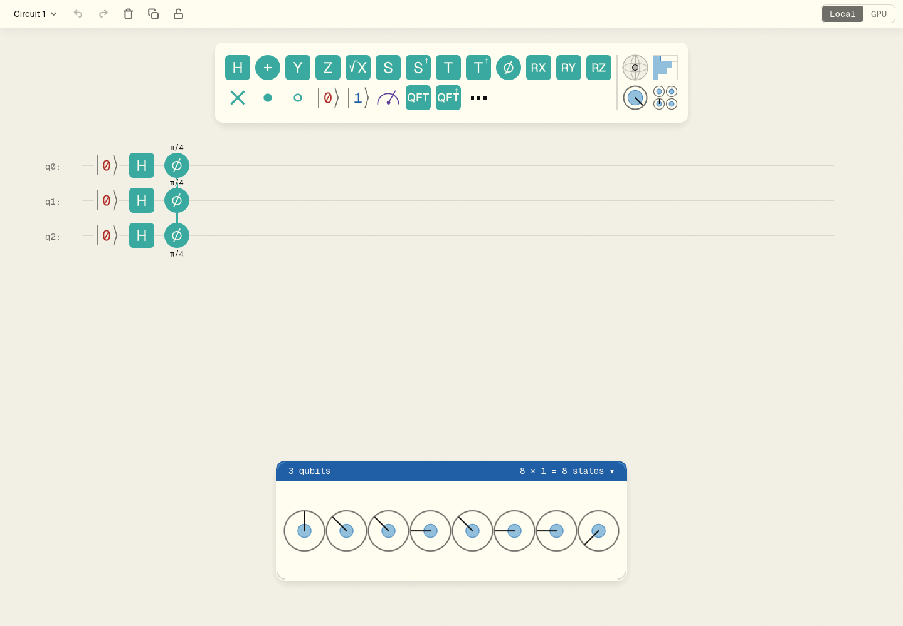

# CPHASE 移植のSTOP: 同角度PHASE列の意味

2026-10-11、pin `785c8b786c9eb0b7cb48d435d8215aaf45177ea1` (PR #55、PR #56を含む)、実WebGPU Chromium 152.0.7977.82で再現。本文を変更して回避せず、CPHASEページは公開対象から外した。上流修正が必要。issue: https://github.com/qniapp/qni-webgpu/issues/57 。

元教材 `https://qniapp.github.io/qni/cphase.html` の「ハンズオン」は、2個のcontrol + PHASE(π/4)を同角度の3個のPHASEへ書き換え、回転する円が1個になることを確認するよう求めている。元sourceは `qni` の `origin/main:apps/tutorial/cphase.html`。同ページの2個のPHASEとcontrol + PHASEの等価図も同じ契約を持つ。

## 実ユーザーに近い再現

公開standalone `/qni-tutorial-webgpu/app/#<URI-encoded JSON>` へ、新規documentで次を開く。GPU-only経路を使い、全回路実行のstate vectorを `qni-web.js` の `read_state_vector()` から読む。

```json
{"cols":[["|0>","|0>","|0>"],["H","H","H"],["P(π/4)","P(π/4)","P(π/4)"]]}
```

期待: 状態0-6は `sqrt(1/8) + 0i`、状態7のみ `0.25 + 0.25i`。CCPHASEとして1状態だけがπ/4回転する。

実際: 状態1/2/4がπ/4、3/5/6がπ/2、7が3π/4回転する。独立した3個のPHASEとして実行され、7状態が回転する。normは約1、console/page errorsは0だが、元の意味と一致しない。単にrunning/step0/norm1だけを見ると検出できない。



対照としてSWAP、3-CNOTによるSWAP、Bell状態、control + PHASE(π/4)、単独PHASE、3種類のCZ (control+PHASE(π)、control+Z、controlのみ) は実GPUで期待vectorと一致した。8ケース合格、同角度3-PHASEの1ケース不一致。

- 再現script: `/tmp/qtw-swap-behavior.mjs`
- vector/期待値: `/tmp/qtw-swap-behavior.json`
- 実画面: `/tmp/qtw-swap-behavior-three-phases.png`
- 未公開CPHASE draft/fixture: `/tmp/qtw-blocked-cphase/`

CPHASE draftではimage `phase_bit3_ket_pair.png` を既存interactive PHASE pair図へ置換し、palette `[[],[],["P(π/4)","•"],["P(π)","Z","•"]]`、max-wire-count `[1,1,1,1]` を照合済み。πラベルの下端が出すHTML内縦scrollは自然な16px下paddingで解消し、390/1440でscroll0を確認した。ただし意味不一致が優先するため公開しない。上流解決後、元の4回路/本文/図と実GPU動作を再確認してからsidebar順で再開する。
